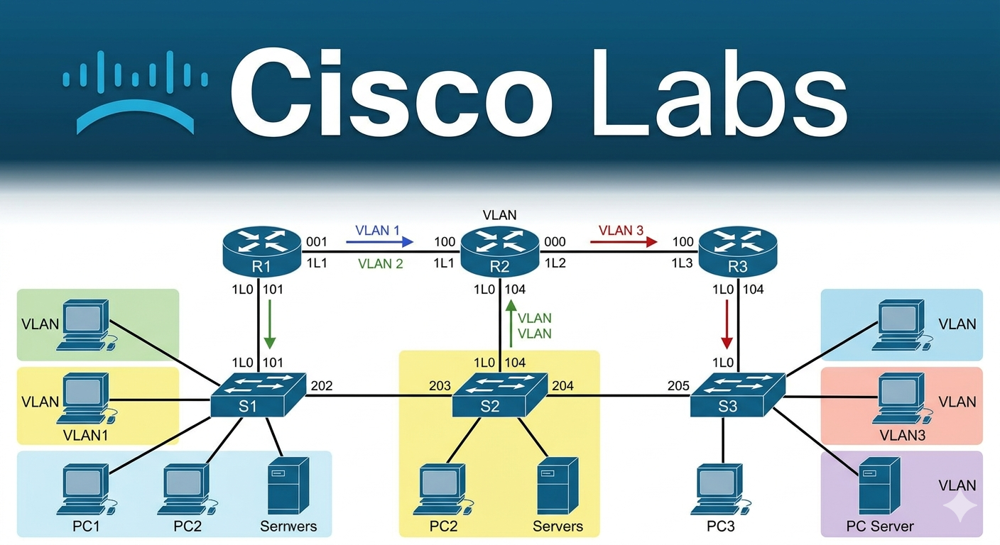

# Cisco CCNA 200-301 Labs - Jeremy's IT Lab

This repository contains my completed lab files and configurations for the **Jeremy's IT Lab CCNA 200-301** course. The goal of this project is to demonstrate hands-on proficiency with Cisco IOS, networking fundamentals, and routing/switching technologies.

<h1 align="center">Cisco Labs</h1>

  

## Course Overview
Jeremy's IT Lab is a comprehensive, free CCNA 200-301 course on YouTube. It includes:
* **Video Lectures:** 60+ days of structured lessons.
* **Hands-on Labs:** Practical exercises using Cisco Packet Tracer.
* **Anki Flashcards:** Daily review of key concepts and commands.

## Completed Labs

The following Packet Tracer (`.pkt`) files represent the labs completed so far:

| Day | Lab Title | Key Concepts Covered |
| :--- | :--- | :--- |
| **01** | [Packet Tracer Introduction](https://github.com/Jvpjava/Cisco-CCNA-200-301-Labs---Jeremy-s-IT-Lab/blob/main/Labs/Day-01/Readme.md) | Navigating the PT interface, adding devices, and basic cabling. |
| **02** | Connecting Devices | Understanding cable types (Straight-through, Crossover) and console access. |
| **03** | OSI Model | Visualizing data flow through layers and PDU encapsulation. |
| **04** | Basic Device Security | Configuring hostnames, passwords (enable secret), and VTY line security. |
| **06** | Ethernet LAN Switching | MAC address tables, frame switching logic, and interface duplex/speed. |
| **08** | IPv4 Addresses | Assigning IP addresses to hosts and verifying connectivity. |
| **09** | Interface Configuration | Configuring Cisco router and switch interfaces, `no shutdown`, and descriptions. |
| **11** | Configuring Static Routes | Implementing recursive, next-hop, and directly attached static routes. |
| **11** | Troubleshooting Static Routes | Identifying misconfigurations in routing tables and fixing reachability issues. |

## Tools Used
* **Cisco Packet Tracer:** For network simulation and configuration.
* **Cisco IOS:** Practical experience with CLI commands.
* **GitHub:** For version control and documentation of my learning journey.

## How to Use This Repo
1.  Download and install [Cisco Packet Tracer](https://www.netacad.com/courses/packet-tracer).
2.  Clone this repository: `git clone https://github.com/[YOUR-USERNAME]/CCNA-Labs.git`
3.  Open any `.pkt` file to view the topology and completed configurations.

---
*Progress: Day 11 / 60+*
***
