# **Rapid Spanning Tree Protocol (RSTP) —**

## Overview and Motivation

Classic Spanning Tree Protocol (STP) can be quite slow, taking up to **50 seconds** for the network to converge after a change in topology. Rapid Spanning Tree Protocol (RSTP) improves this time dramatically, only taking **a few seconds** to respond to changes in the network.

**Key takeaway:** RSTP is superior to classic STP because it converges much faster after a topology change.

#### **Cisco's Implementation: Rapid Per-VLAN Spanning Tree (Rapid PVST+)**

Cisco's version of RSTP is called **Rapid Per-VLAN Spanning Tree** (Rapid PVST+). This is the default STP mode on most modern Cisco devices.

#### **Importance for the CCNA Exam**

The CCNA exam topics only mention **Rapid Spanning Tree Protocol** (RSTP). However, understanding classic STP first provides a strong foundation that makes learning RSTP much easier.

### RSTP & STP Differences

| Classic STP                       | Rapid STP                                               |  |
|-----------------------------------|---------------------------------------------------------|--|
| Convergence time up to 50 seconds | Convergence in a few seconds                            |  |
| Slow response to topology changes | Fast response to topology changes                       |  |
| Older standard                    | Newer, superior standard; default on most devices today |  |

**Final note:** Because RSTP is superior to classic STP, it is now the default on most devices, and the CCNA exam focuses exclusively on RSTP.

# Rapid Spanning Tree Protocol (RSTP) — Versions of Spanning Tree

#### **Overview of STP Versions**

| IEEE Standard (Industry Standard)                  | Cisco Proprietary (Upgrade)                                                 |  |  |
|----------------------------------------------------|-----------------------------------------------------------------------------|--|--|
| 802.1D — Classic STP                               | PVST+ — Per-VLAN Spanning Tree Plus                                         |  |  |
| 802.1w — Rapid STP (RSTP)                          | Rapid PVST+ — Rapid Per-VLAN Spanning Tree Plus                             |  |  |
| 802.1s — MSTP (Multiple Spanning Tree Protocol) | (No Cisco proprietary version — Cisco runs the industry standard 802.1s) |  |  |

### 802.1D — Classic Spanning Tree Protocol (STP)

- The **original** spanning tree protocol; originally published in **1990** (originally created in **1985** before being standardized)
- **All VLANs share one STP instance**
- **Cannot load balance** since there is only one instance, we cannot block different ports in each VLAN to achieve load balancing

### PVST+ — Per-VLAN Spanning Tree Plus

- Cisco's upgrade to **802.1D**
- **Each VLAN has its own STP instance**
  - This is why commands required the VLAN number (e.g., spanning-tree vlan 1 root primary) — a separate STP instance runs for each VLAN
- **Can load balance** we can block different ports in each VLAN, in each STP instance, and use network bandwidth more effectively (no connections go totally unused, just waiting for another connection to fail)
- *Note: Before PVST+, Cisco developed regular Per-VLAN Spanning Tree, which only supported ISL trunk encapsulation (no dot1q). This version is no longer relevant since everyone uses dot1q for trunk encapsulation these days.*

#### Why Rapid STP Was Needed

Classic STP and PVST+ are **quite slow**:

**Max Age timer:** 20 seconds

**Listening state:** 15 seconds

**Learning state:** 15 seconds

**Total:** Up to **50 seconds** to respond to changes in the network

*That's simply not fast enough for modern networks.*

### 802.1w — Rapid Spanning Tree Protocol (RSTP)

- Much **faster** at converging and adapting to network changes than 802.1D
- However, just like 802.1D, the industry standard RSTP runs **only one STP instance**, shared by all VLANs
- **Cannot load balance**

### Rapid PVST+ — Rapid Per-VLAN Spanning Tree Plus

- Cisco's upgrade to **802.1w**
- Features the **improved speed** of rapid STP
- Runs a **separate STP instance for each VLAN**
- **Can load balance** by blocking different ports in each VLAN, just like PVST+
- **This is the version Cisco switches run and the version mentioned in the CCNA exam topics**
- **This is the version we'll be focusing on**

### 802.1s — Multiple Spanning Tree Protocol (MSTP)

- Uses **modified RSTP mechanics**
- Can **group multiple VLANs into different instances**
  - Example: 10 VLANs VLANs 1–5 in Instance 1, VLANs 6–10 in Instance 2

- **First industry standard version of STP that allows load balancing**
- **Superior to Cisco's Rapid PVST+** for large networks:
  - If you have **200 VLANs**, configuring primary and secondary root bridges in each VLAN is a lot of work
  - With MSTP, simply assign VLANs 1–100 to Instance 1, VLANs 101–200 to Instance 2, then configure primary and secondary root bridges for each instance — **much easier to configure and manage**
- Cisco has **not** developed their own version of MSTP; Cisco devices run the **industry standard 802.1s**
- **Best for large networks** with many VLANs

### Summary: When to Use What

| Network Size                                              | Recommended Version           |  |
|-----------------------------------------------------------|-------------------------------|--|
| Small to medium networks (without a huge number of VLANs) | Rapid PVST+ (Cisco's version) |  |
| Large networks (many VLANs)                               | MSTP (802.1s)                 |  |

*Note: All of the information covered applies to the industry standard 802.1w, but that's not the version that runs on Cisco switches. Since you already understand classic STP and PVST+, it will be much easier to learn rapid STP and rapid PVST+ by comparing it to the previous versions.*

## Cisco's Summary of RSTP

- **RSTP is not a timer-based** spanning tree algorithm like 802.1D
- RSTP offers an improvement over the **30 seconds or more** that 802.1D takes to move a link to forwarding
- The heart of the protocol is a **new bridge-bridge handshake mechanism**, which allows ports to **move directly to forwarding**

*Key difference: 802.1D uses long timers to determine when it's safe to move to the next state (these timers are quite long to ensure no loops are accidentally created when a port starts forwarding). RSTP instead uses a handshake mechanism switches actively negotiate with other switches and move ports immediately to the forwarding state if appropriate.*

#### Important Note on Terminology

- **RSTP** and **Rapid PVST+** will be used **interchangeably** throughout the lecture
- Cisco's Rapid PVST+ operates **the same as RSTP**, but with the addition of a **separate instance for each VLAN**

#### Similarities Between STP and RSTP

RSTP is not a "revolution" of STP, just an **"evolution"**. It made major improvements to speed up STP but didn't change it completely.

- 1. **Same purpose** blocking specific ports to prevent Layer 2 loops
- 2. **Root bridge election** same rules as STP (switch with the **lowest bridge ID** becomes the root bridge)
- 3. **Root port election** same rules as STP (interface with the **lowest root cost** becomes the root port, with the same tie-breakers: **neighbor bridge ID**, then **neighbor port ID**)
- 4. **Designated port election** same rules as STP (the interface on the switch with the **lowest root cost** becomes designated; if there is a tie, the switch with the **lowest bridge ID** sets its interface to designated)

## RSTP Differences — Port Costs, States, and Roles

#### Updated Port Costs

Classic STP defines port speeds up to 10 Gbps (port speeds faster than this are all given a cost of 1). RSTP's cost values were expanded to accommodate faster speeds:

| Speed STP Cost RSTP Cost |
|--------------------------------|
|--------------------------------|

| 10 Mbps  | 100 | 2,000,000 |
|----------|-----|-----------|
| 100 Mbps | 19  | 200,000   |
| 1 Gbps   | 4   | 20,000    |
| 10 Gbps  | 2   | 2,000     |
| 100 Gbps | x   | 200       |
| 1 Tbps   | x   | 20        |
| 10 Tbps  | x   | 2         |

*Use the flashcards to remember the port costs of both classic STP and rapid STP.*

### Simplified Port States

| STP Port State | Send/Receive BPDUs | Frame forwarding (regular traffic) | MAC address learning | Stable/ Transitional |
|----------------|-----------------------|------------------------------------------|-------------------------|-------------------------|
| Blocking       | NO/YES                | NO                                       | NO                      | Stable                  |
| Listening      | YES/YES               | NO                                       | NO                      | Transitional            |
| Learning       | YES/YES               | NO                                       | YES                     | Transitional            |
| Forwarding     | YES/YES               | YES                                      | YES                     | Stable                  |
| Disabled       | NO/NO                 | NO                                       | NO                      | Stable                  |

Classic STP has five port states: **blocking, listening, learning, forwarding, and disabled**. RSTP simplifies these to just **three** port states by combining states:

- **Blocking** and **disabled** → combined into **Discarding**
- **Listening** → simply **not used** in RSTP (also falls under Discarding)
- **Learning** and **forwarding** → remain **unchanged**

| STP Port State | Send/Receive BPDUs | Frame forwarding (regular traffic) | MAC address learning | Stable/ Transitional |
|----------------|-----------------------|------------------------------------------|-------------------------|-------------------------|
| Discarding     | NO/YES                | NO                                       | NO                      | Stable                  |
| Learning       | YES/YES               | NO                                       | YES                     | Transitional            |
| Forwarding     | YES/YES               | YES                                      | YES                     | Stable                  |

| RSTP State | Description                                                                                                                                                                                                                               |
|------------|-------------------------------------------------------------------------------------------------------------------------------------------------------------------------------------------------------------------------------------------|
| Discarding | Port is administratively disabled (shutdown command applied) — previously the disabled state. OR, port is enabled but blocking traffic to prevent Layer 2 loops — previously the blocking state. Also replaces the listening state. |
| Learning   | (Same as classic STP)                                                                                                                                                                                                                     |
| Forwarding | (Same as classic STP)                                                                                                                                                                                                                     |

#### Port Roles

The three original port roles in classic STP are **root**, **designated**, and **non-designated**. In RSTP:

### **Unchanged Roles**

- **Root port** remains the same; the port **closest to the root bridge** (i.e., the port with the **lowest root cost**) becomes the root port. The root bridge is the only switch that **doesn't** have a root port.
- **Designated port** remains the same; the port on a segment (another name for a **collision domain**) that sends the **best BPDU** is that segment's designated port. There can only be **one** designated port per segment. The other port on the segment is either a root port or a nondesignated port (in classic STP).

#### **Changed Role**

- **Non-designated** → divided into **two** separate roles in RSTP:
  - **Alternate port role**
  - **Backup port role**

# RSTP Port Roles — Alternate and Backup Ports & STP Features

#### Alternate Port Role

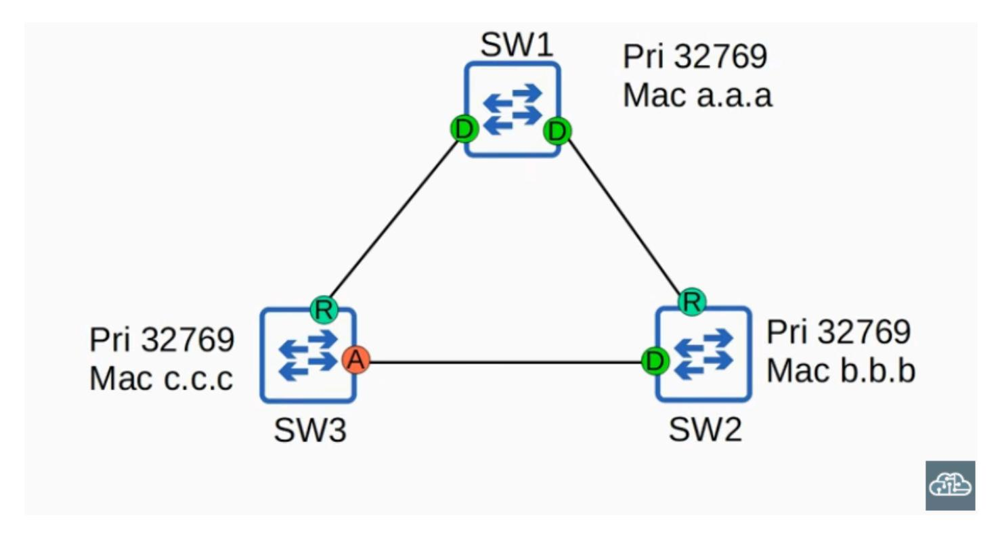

- A **discarding port** that receives a **superior BPDU from another switch**
- This is the same as what you already learned about **blocking ports** in classic STP

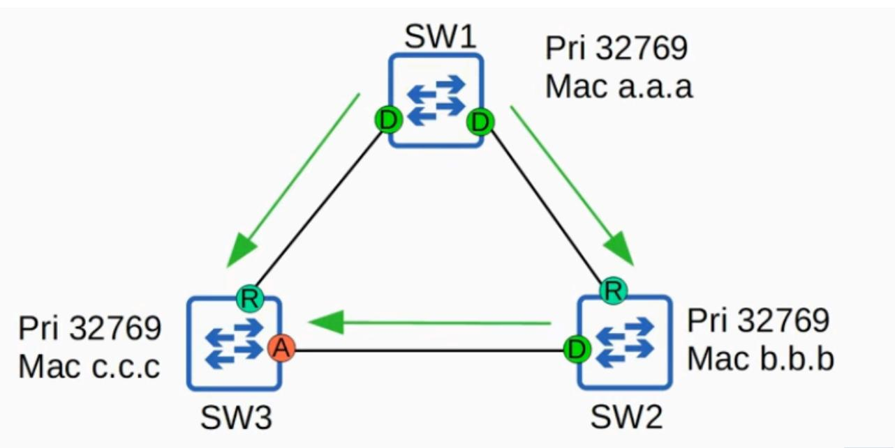

- In the example topology: SW1 is the root bridge. SW3 receives a superior BPDU from SW2 (because SW2's bridge ID is lower than SW3's). So SW2's interface is **designated**, and SW3's interface becomes an **alternate port**.
- An alternate port functions as a **backup to the root port**

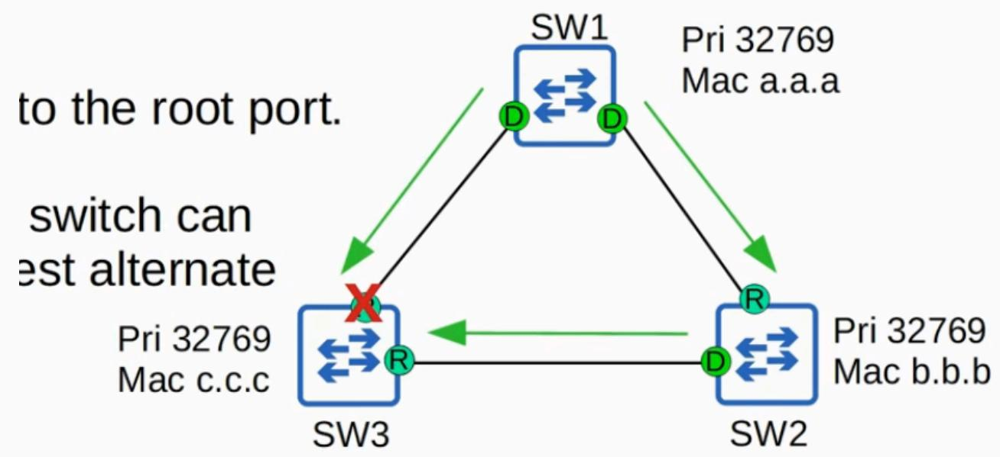

- If the root port fails, the switch can **immediately move its best alternate port to forwarding** as the new root port
- This move happens with **no transitional states**

- This immediate move to forwarding state functions like a classic STP optional feature called **UplinkFast**
  - Because it is **built into RSTP**, you do **not** need to activate UplinkFast when using RSTP or Rapid PVST+

#### UplinkFast

- Allows a switch to **immediately move an alternate port to forwarding** if the root port fails
- In classic STP, this had to be **explicitly configured**
- In RSTP, this functionality is **built in and operates by default** no configuration needed

#### BackboneFast

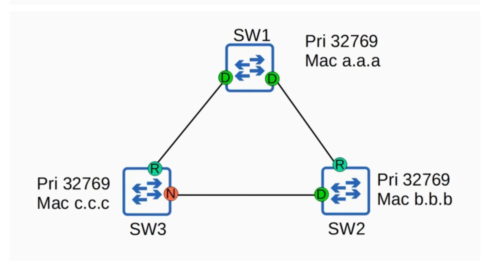

Helps a switch **quickly recover** when it loses its connection to the root bridge

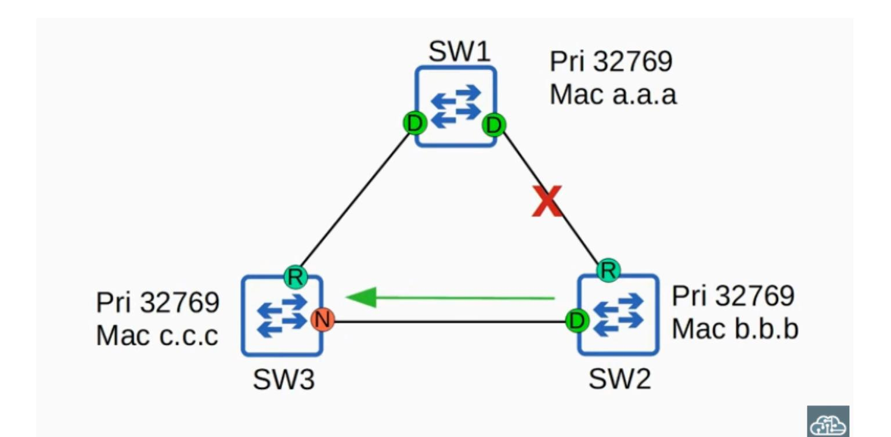

**Example:** SW2's root port is cut off, so it stops receiving BPDUs from the root bridge and assumes it is the root bridge, sending its own BPDUs to SW3. SW3 receives BPDUs from both SW1 and SW2, but SW2's BPDUs are inferior (higher bridge ID).

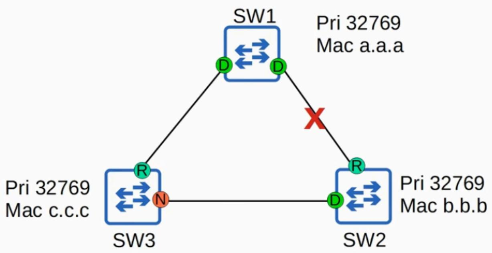

**Without BackboneFast:** SW3 would ignore SW2's inferior BPDUs until its non-designated port

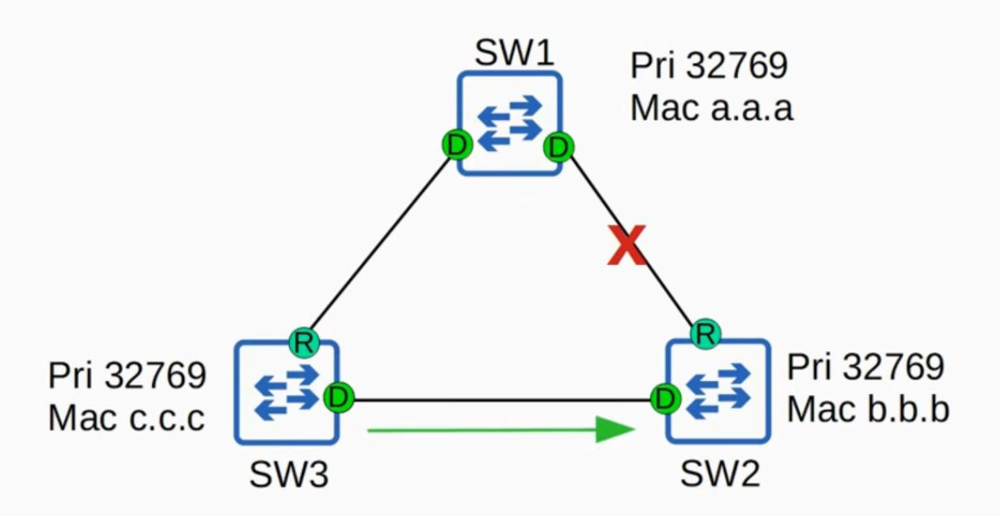

in classic STP finally changes to forwarding and forwards the superior BPDUs to SW2 which then accepts SW1 as its Root Bridge again.

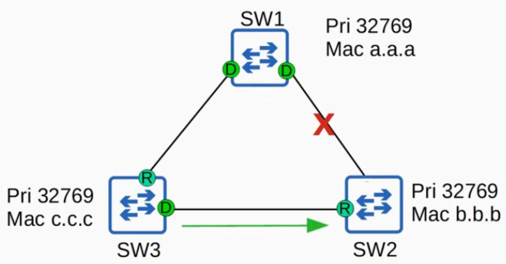

- **With BackboneFast:** SW3 **expires the max age timer** on that interface and **rapidly forwards** the superior BPDUs to SW2, so SW2 accepts SW1 as its root bridge again
- In classic STP, this had to be **explicitly configured**
- In RSTP, this functionality is **built in and operates by default** no configuration needed

#### Summary: UplinkFast & BackboneFast

|                            | Classic STP                                    | RSTP                                                                                                         |  |  |
|----------------------------|------------------------------------------------|--------------------------------------------------------------------------------------------------------------|--|--|
| Configuration required? | Yes — must be configured on the switch   | No — built in and operate by default                                                                         |  |  |
| CCNA requirement        | Not necessary to know how to configure them | Know their names and basic purpose: help blocking or discarding ports move to forwarding without delay |  |  |

*Neither UplinkFast nor BackboneFast are on the CCNA exam topics list, but be aware that their functionality is built into RSTP — you may get asked about that on the exam.*

#### Backup Port Role

- A **discarding port** that receives a **superior BPDU from another interface on the same switch**
- This only happens when **two interfaces are connected to the same collision domain, via a hub**

#### **Topology for Backup Port Role:**

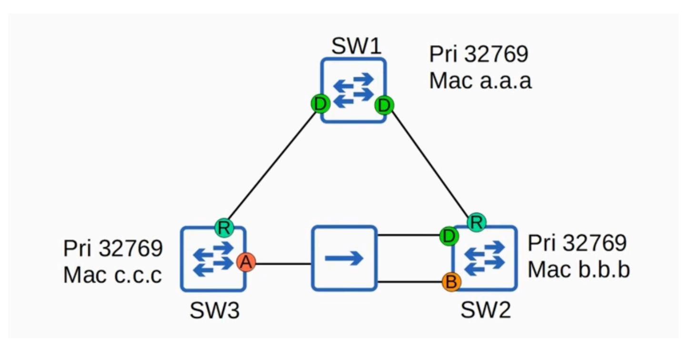

#### How It Works

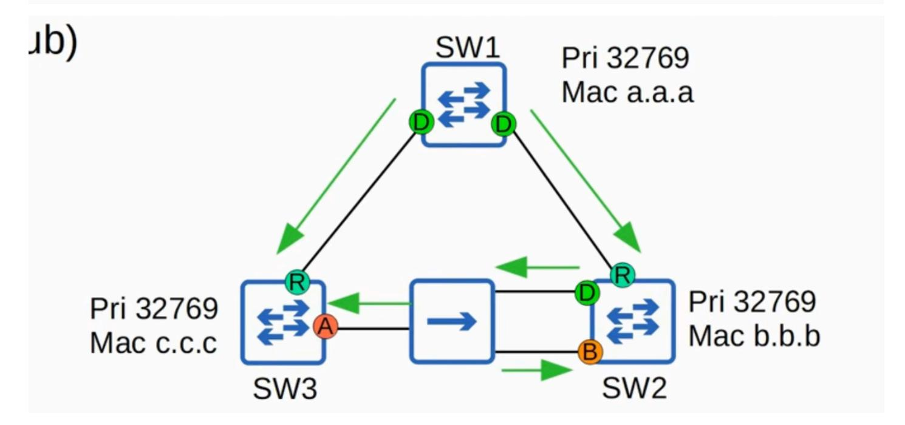

- When an ethernet hub is connected between two switches (e.g., SW2 and SW3), the BPDU sent out of SW2's designated port is **flooded by the hub**
- SW2 receives that **same BPDU on a different interface** that's why this interface is a **backup port**, not an alternate port
- Since hubs are not used in modern networks, you will **probably not encounter an RSTP backup port** in practice, but it's still something you should know

### Backup Port Function

- Functions as a **backup for a designated port**
- If the designated port fails, the backup port **immediately begins forwarding traffic** as a designated port

#### Designated vs. Backup Selection

- When two interfaces on the same switch are connected to the same collision domain (via a hub):
  - The interface with the **lowest port ID** is selected as the **designated port**
  - The other interface becomes the **backup port**

# RSTP Port Roles — Quiz Question

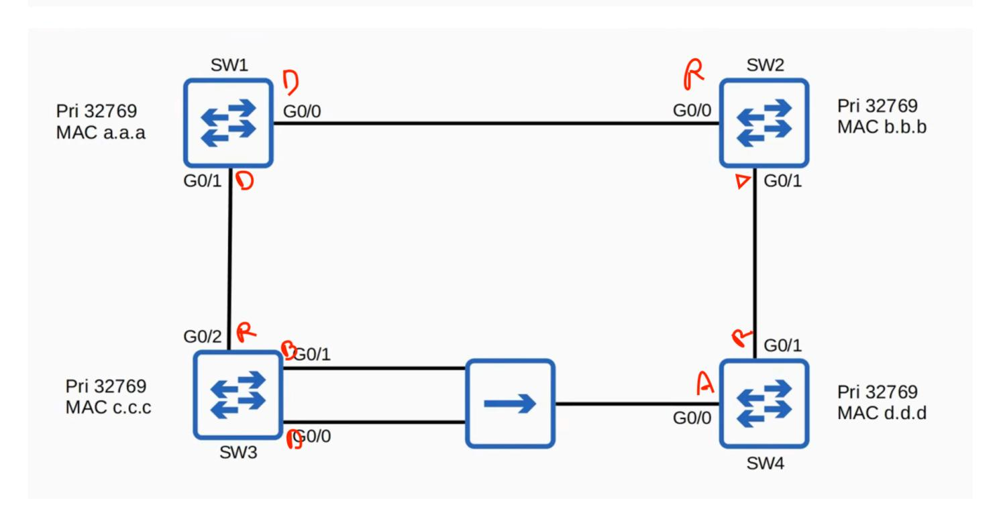

Identify the root bridge and the RSTP port role of each switch interface in the network. Note: The hub does **not** participate in spanning tree — hubs aren't sophisticated enough and simply flood all frames they receive.

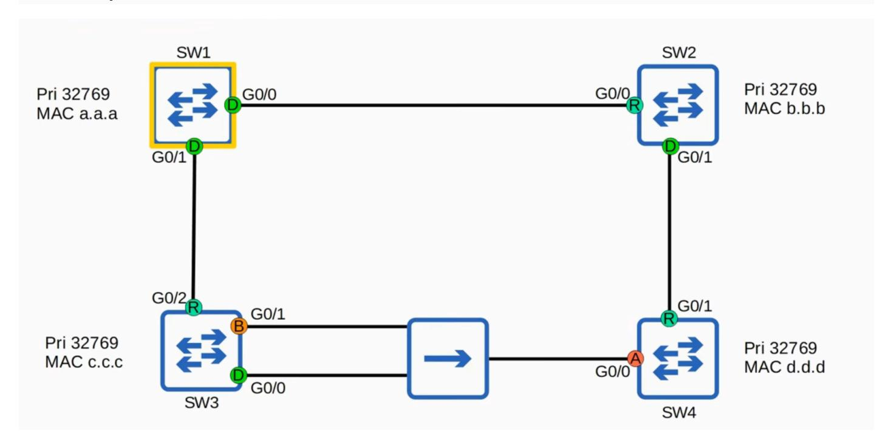

#### Root Bridge

**SW1** is the root bridge — all switches have the same priority, and SW1 has the **lowest MAC address**

#### SW1 (Root Bridge)

Both interfaces are **designated ports**

#### Root Ports

- **SW2 G0/0** root port (lowest root cost)
- **SW3 G0/0** root port (lowest root cost)
- **SW4 G0/1** root port
  - The hub doesn't participate in STP, so it doesn't add any cost to the BPDU
  - SW4 chose G0/1 over G0/0 because the **neighbor bridge ID is lower** via G0/1 (SW2 has a lower MAC address than SW3)

### Designated Ports

- **SW2 G0/1** designated (connected to SW4's G0/1)
- **SW3 G0/0** designated (SW3 has a **lower root cost** than SW4; G0/0 has the **lower port ID**, so it is the designated port in this collision domain)

#### Backup Port

**SW3 G0/1** — backup port (receives a superior BPDU with the lower port ID **from the same switch**)

### Alternate Port

**SW4 G0/0** — alternate port (receives a superior BPDU **from a different switch**)

## RSTP — CLI Verification and Compatibility

#### Verifying RSTP in the CLI

- Three STP modes available on a Cisco switch: **MST**, **PVST**, and **Rapid-PVST**
- **Rapid-PVST is the default** on modern Cisco switches, so you probably won't have to use the command, but it can be entered manually:
  - spanning-tree mode rapid-pvst

- Use show spanning-tree to confirm:
  - Previously with classic STP, it displayed **'ieee'**
  - With RSTP, it displays **'Spanning tree enabled protocol rstp'**
  - Although it says **'rstp'**, it is actually Cisco's **Rapid PVST+** running

#### CLI Output Notes

In the show spanning-tree output:

|       |      |     |   |       | -11 |
|-------|------|-----|---|-------|-----|
| Gi0/0 | Desg | FWD | 4 | 128.1 | Shr |
| Gi0/1 | Back | BLK | 4 | 128.2 | Shr |
| Gi0/2 | Root | FWD | 4 | 128.3 | P2p |

SW3's G0/1 interface shows the **'backup'** role

| Gi0/0 | Altn | BLK | 4 | 128.1 | P2p |  |
|-------|------|-----|---|-------|-----|--|
| Gi0/1 | Root | FWD | 4 | 128.2 | P2p |  |

- SW4's G0/0 interface shows the **'Alternate'** role
- The status is listed as **BLK (blocking)** in the output, even though the actual state name in rapid STP is **discarding**

### RSTP and Classic STP Compatibility

- Rapid STP **is compatible** with classic STP
- If a rapid STP-enabled switch has an interface connected to a classic STP-enabled switch, **that specific interface** will operate in classic STP mode:
  - Same timers
  - Same **blocking → listening → learning → forwarding** state process
- The other interfaces on the rapid STP-enabled switch that connect to other rapid STP-enabled switches **remain in rapid STP mode**

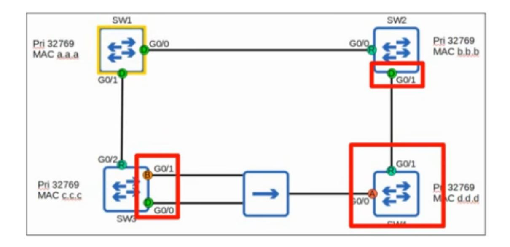

*Example: If SW4 was running classic STP, SW2 and SW3 would make their interfaces connected to SW4 run in classic STP mode, but their interfaces connected to SW1 would remain in rapid STP mode.*

## RSTP BPDU — Differences from Classic STP

Most of the RSTP BPDU remains unchanged from classic STP, but there are key differences to know. (You do **not** need to memorize the full BPDU for the CCNA — just know the key aspects and what is included in it.)

#### Key Differences

#### **1. Protocol Version**

Classic STP: **Version 0**

Rapid STP: **Version 2**

#### **2. BPDU Type**

Classic STP BPDU uses a **BPDU type of 0**

Rapid STP BPDU uses a **BPDU type of 2**

#### **3. BPDU Flags**

Classic STP uses only **2 bits** of the BPDU flags (the **1st bit** and the **8th bit**)

- Rapid STP uses **all 8 bits**
- These flags are used in the **negotiation process** that allows rapid STP to converge much faster than classic STP

#### **4. BPDU Origination**

- **Classic STP:** Only the **root bridge** originates BPDUs; other switches simply **forward** the BPDUs they receive
- **Rapid STP: ALL switches** originate and send their own BPDUs from their designated ports

# RSTP BPDU Differences — BPDU Aging and Topology Changes

## All Switches Send Their Own BPDUs

All switches running rapid STP send their own BPDUs (as previously mentioned)

### Faster BPDU Aging

- **Classic STP:** A switch waits **10 hello intervals** (20 seconds) before considering a neighbor lost
- **Rapid STP:** A switch considers a neighbor lost if it **misses 3 BPDUs** (6 seconds)

### MAC Address Flushing

- When a neighbor is considered lost, the switch will **flush** (delete) all MAC addresses learned on that interface
- **Reason:** The neighbor is down, so the switch knows it can't reach anything through that interface anymore

#### Topology Change Example

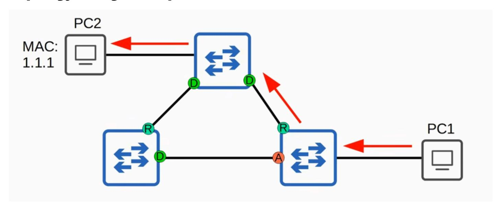

Normally, traffic from PC1 to PC2 follows a direct path between switches

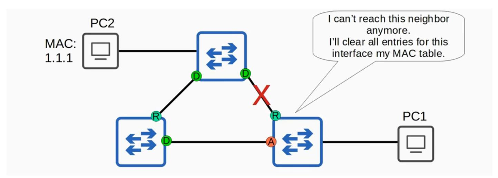

- If that connection is cut off:
  - 1. The switch thinks: "I can't reach this neighbor anymore"
  - 2. It **clears all entries** for that interface from its MAC table

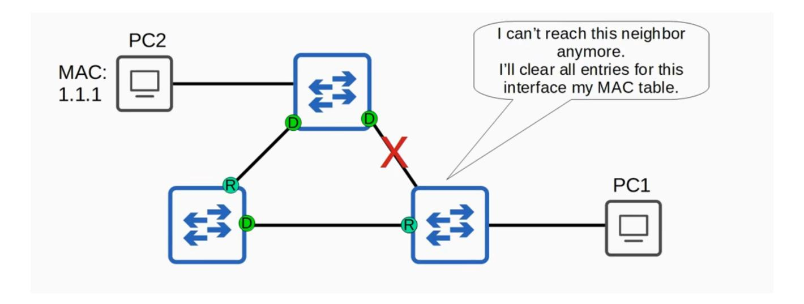

3. Its other interface becomes the **root port**

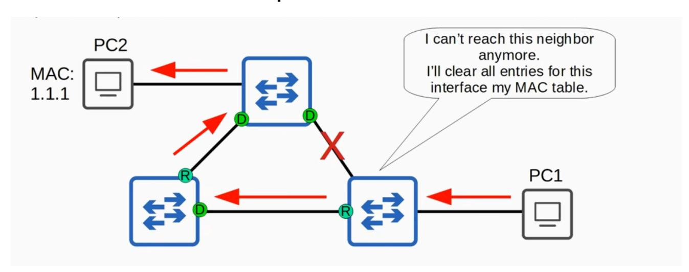

- 4. If PC1 wants to send traffic to PC2 again, it goes through the normal process of **flooding** until the MAC address is learned on the new interface
- 5. Traffic will now follow the new path

*There is more depth that could be covered regarding how topology changes are handled in rapid STP, but it's not necessary for the CCNA. If you pursue your CCNP or CCIE, you'll have to study these processes more in depth.*

# RSTP Link Types

#### Overview

RSTP distinguishes between three different **link types**. Don't confuse these link types with spanning tree port roles or port states. The **point-to-point** and **shared** link types distinguish between fulland half-duplex connections, and the **edge** type is a port that uses portfast.

#### Edge Link Type

- A port connected to an **end host**
- Moves **directly to forwarding** without negotiation
- This is the **PortFast** functionality built into RSTP (another classic STP optional feature incorporated into RSTP, alongside UplinkFast and BackboneFast)
- Because there is no risk of creating a loop, they can move straight to the forwarding state without the negotiation process
- Configured by enabling PortFast on the port (same command as classic STP): spanning-tree portfast
- **PortFast and an RSTP edge port are the same thing**
- **Which ports are edge ports?**

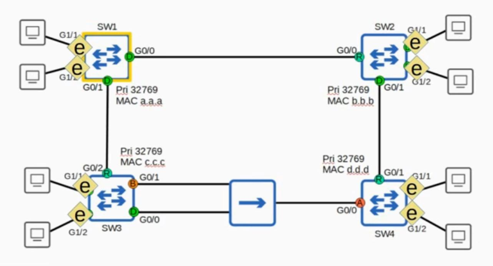

All ports connected to **end hosts (PCs)**

### Point-to-Point Link Type

- Ports that connect **directly to another switch**
- Because they connect to a switch (not a hub), they function in **full-duplex** mode
- You **don't need to configure** this the switch detects that it is connected directly to another switch and will operate in full-duplex as a point-to-point port
- **Manual configuration** (if needed): spanning-tree link-type point-to-point
- **Which ports are point-to-point?**

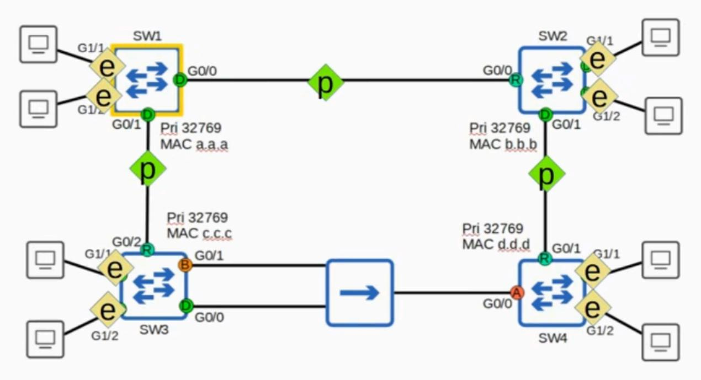

The **direct connections between two switches**

### Shared Link Type

- A connection to a **hub**
- Due to the nature of hubs and the likelihood of collisions, these links must function in **halfduplex**
- You **don't need to configure** this the switch will detect it
- **Manual configuration** (if needed): spanning-tree link-type shared
- **You will probably never see this link type in real networks** hubs are old technology that have been fully replaced by switches
- **Which ports are shared?**

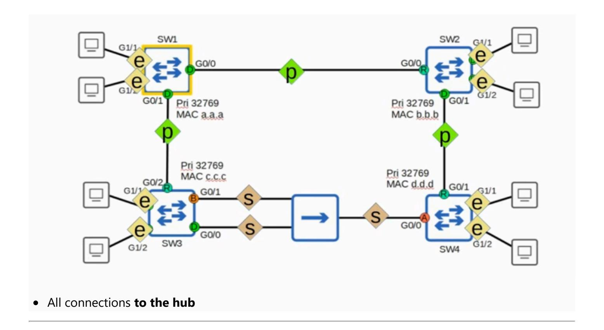

# RSTP Summary — Quick Review

## STP Versions

| Standard                | Cisco Version                                     | Key Feature                                      |  |  |  |
|-------------------------|---------------------------------------------------|--------------------------------------------------|--|--|--|
| 802.1D (Classic STP) | PVST+                                             | Separate instance per VLAN                       |  |  |  |
| 802.1w (Rapid STP)   | Rapid PVST+                                       | Separate instance per VLAN + fast convergence |  |  |  |
| 802.1s (MSTP)           | (No Cisco version — industry standard is used) | Group multiple VLANs into instances              |  |  |  |

#### Rapid STP Overview

**Evolution** of classic STP, not a revolution

- Uses a **negotiation process** instead of timers to rapidly move ports to forwarding and adapt to topology changes
- Specific details of the negotiation process are **not necessary for the CCNA**

#### RSTP Port States (3 total)

| State      | Description                                                                                        |  |  |
|------------|----------------------------------------------------------------------------------------------------|--|--|
| Discarding | Replaces blocking, listening, and disabled states                                                  |  |  |
| Learning   | (Same as classic STP — often skipped due to built-in features like UplinkFast and BackboneFast) |  |  |
| Forwarding | (Same as classic STP)                                                                              |  |  |

### RSTP Port Roles (4 total)

| Role       | Description                                                                                                                    |  |
|------------|--------------------------------------------------------------------------------------------------------------------------------|--|
| Root       | Same as classic STP                                                                                                            |  |
| Designated | Same as classic STP                                                                                                            |  |
| Alternate  | Discarding port receiving a superior BPDU from another switch (the usual case)                                                 |  |
| Backup     | Discarding port receiving a superior BPDU from an interface on the same switch (only occurs via a hub — rarely encountered) |  |

### Classic STP Optional Features Built into RSTP

- **UplinkFast** built into RSTP (detailed knowledge not required for CCNA)
- **BackboneFast** built into RSTP (detailed knowledge not required for CCNA)
- **PortFast** built into RSTP via the **edge port** function (you **do** need to know PortFast for the CCNA)

### RSTP BPDU Key Points

- **Protocol version:** 2 (classic STP uses version 0)
- **All switches** originate and send their own BPDUs (classic STP: only the root bridge originates BPDUs)

#### RSTP Link Types

| Link Type      | Connection                                               | Configuration                                                                                                       |
|-------------------|----------------------------------------------------------|---------------------------------------------------------------------------------------------------------------------|
| Edge              | Connected to an end host                                 | spanning-tree portfast                                                                                              |
| Point-to point | Connected directly to another switch (full duplex) | Auto-detected, or spanning-tree link-type point-to point                                                         |
| Shared            | Connected to a hub (half duplex)                      | Auto-detected, or spanning-tree link-type shared — rarely seen in real networks since hubs are no longer used |